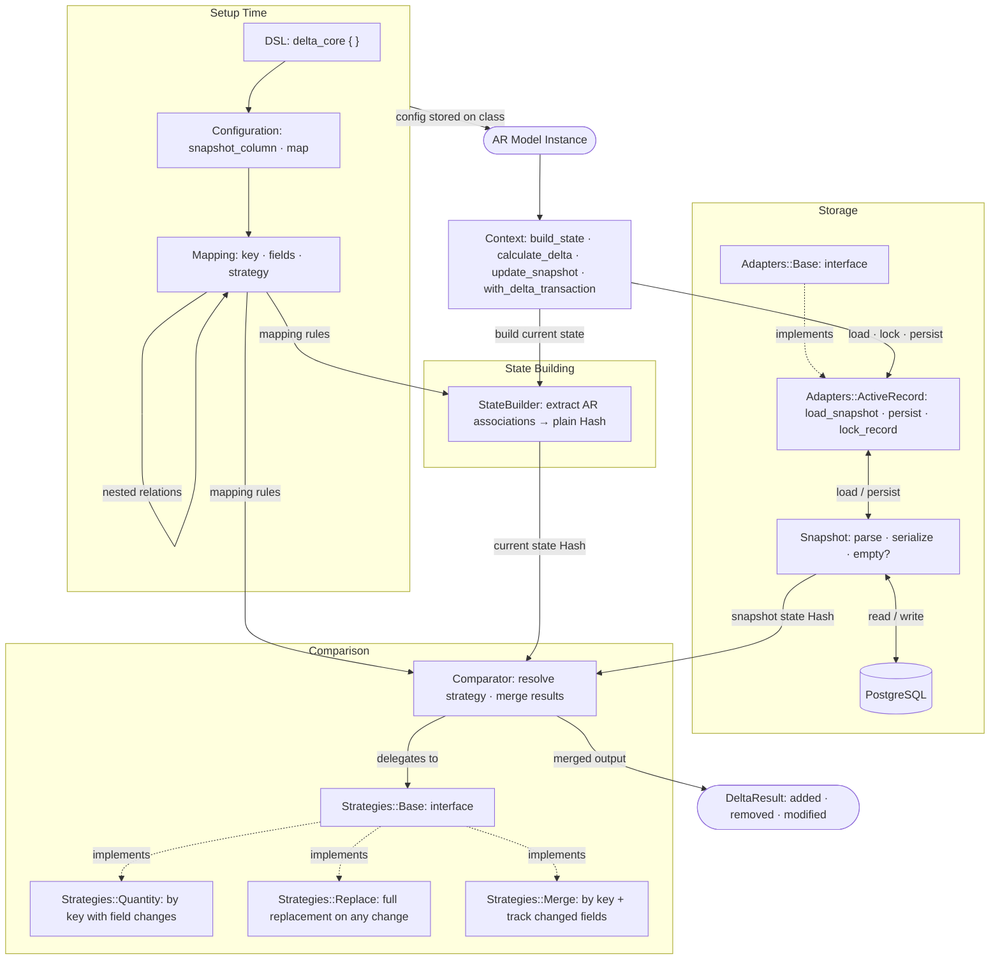

# DeltaCore

DeltaCore persists explicit snapshots of confirmed class state and compares them
against current state to produce structured, deterministic delta results. It distinguishes added,
removed, and modified entities, supports pluggable comparison strategies (quantity, replace, and
partial merge), and integrates with Rails via a configurable DSL with transactional safety and
idempotent delta generation.

## Installation

Install the gem and add it to the application's Gemfile by executing:

```bash
bundle add delta_core
```

If bundler is not being used to manage dependencies, install the gem by executing:

```bash
gem install delta_core
```

## Usage

### Rails DSL

Include the DSL in any class to configure snapshot behaviour and association mapping rules:

```ruby
class Order < ApplicationRecord
  include DeltaCore::DSL

  delta_core do
    snapshot_column :order_delta_data

    map :items,
      key: :product_id,
      fields: [:quantity, :unit_price],
      strategy: :quantity,
      relations: {
        price_changes: {
          key: :id,
          fields: [:amount, :type],
          strategy: :replace
        }
      }
  end
end
```

**Configuration options:**

- `snapshot_column` — the column used to persist the serialized snapshot JSON on the record.
- `map` — declares a top-level association to track. Accepts:
  - `key:` — the unique identifier field used to match entities across snapshots.
  - `fields:` — the list of comparable fields whose changes are detected. Only changes in these fields are captured.
  - `strategy:` — comparison strategy for how changes are detected. One of:
    - `:quantity` — Detects which items are added/removed by key, and which items have field changes.
    - `:replace` — Treats the entire collection as a unit; if anything changes, the full collection is marked as added/removed.
    - `:merge` — Like quantity, but also tracks which specific fields changed in modified items.
  - `relations:` — optional nested association mapping, using the same key/fields/strategy options. Enables multi-level tracking.

### Building State and Computing Deltas

DeltaCore provides methods to inspect current state and compute deltas without persisting:

```ruby
# Get the structured state representation as a Hash
state = order.delta_state
# => { items: [...], price_changes: [...] }

# Get the delta between the last snapshot and current state
delta = order.delta_result
delta.added    # => entities present in current state but absent from snapshot
delta.removed  # => entities present in snapshot but absent from current state
delta.modified # => entities present in both with changed field values
delta.empty?   # => true when no differences exist (idempotent guard)
```

### Persisting Snapshots

Snapshots are only persisted after external confirmation to avoid premature state capture. Choose 
based on whether you need to confirm the delta before persisting:

```ruby
# Simple snapshot capture (raises EmptyDeltaError if no changes)
order.confirm_snapshot!

# Transactional flow with delta confirmation
result = order.with_delta_transaction do |delta|
  # Inspect delta, perform external operations
  # Snapshot is persisted only if block completes successfully
  external_api.submit(delta)
  { success: true }
end
```

### Resetting Delta Flags

Clear any dirty-tracking metadata (extension point for custom implementations):

```ruby
order.reset_delta_flags!
```

## Architecture

The diagram below covers every component in the system and the data flowing between them.
Dashed arrows (`-.->`) denote interface implementation; solid arrows denote runtime data flow.



### Key flows

**`build_state`** — Calls `StateBuilder` to extract a plain Hash representation of all mapped 
associations and their fields from the model. Used by both delta computation and snapshot updates.

**`calculate_delta`** (or `delta_result`) — `Context` calls `StateBuilder` to produce current 
state, loads the persisted `Snapshot` via `Adapters::ActiveRecord`, then passes both into 
`Comparator`. For each `Mapping`, `Comparator` resolves the configured strategy
(`Quantity` / `Replace` / `Merge`) via `Strategies::Base` and merges the results into a
`DeltaResult`.

**`update_snapshot`** (or `confirm_snapshot!`) — Calculates delta and raises `EmptyDeltaError` 
if no changes exist. Acquires a record lock through `Adapters::ActiveRecord`, rebuilds current 
state via `StateBuilder`, serializes it through `Snapshot`, and persists the JSON back to the 
PostgreSQL column. The snapshot never advances if transmission fails.

**`with_delta_transaction`** — Combines delta calculation and snapshot persistence in a single 
transactional block. Acquires a lock, calculates the delta, yields to the block for external 
processing, and only persists the snapshot if the block completes successfully without raising.

## Extension Points

### Custom Strategies

Register custom comparison strategies using the global strategy registry:

```ruby
# Define a custom strategy
module MyStrategy
  def self.call(snapshot_collection, current_collection, mapping)
    # Return hash with :added, :removed, :modified keys
    { added: [], removed: [], modified: [] }
  end
end

# Register it
DeltaCore.register_strategy(:my_strategy, MyStrategy)

# Use it in configuration
class Order < ApplicationRecord
  include DeltaCore::DSL

  delta_core do
    snapshot_column :delta_data
    map :items, key: :id, fields: [:amount], strategy: :my_strategy
  end
end
```

### Mapping Extensions

Extend the state builder to add computed fields or custom transformations to entities:

```ruby
DeltaCore.register_mapping_extension(->(entity, record, mapping) {
  # Add computed fields to entity
  entity[:computed_field] = record.some_method
  entity
})
```

### Custom Adapters

Implement the `Adapters::Base` interface to use a different persistence backend:

```ruby
class MyAdapter
  def load_snapshot(model)
    # Return a Snapshot instance
  end

  def persist(model, serialized_json)
    # Save the JSON somewhere
  end

  def lock_record(model, &block)
    # Ensure thread-safe execution
    yield
  end
end

# Use it
config = DeltaCore::Configuration.new
config.snapshot_column :delta_data
context = DeltaCore::Context.new(config, adapter: MyAdapter.new)
```

## Comparison Strategies

DeltaCore provides three built-in comparison strategies for detecting changes in collections:

### `:quantity`

Detects additions and removals by matching entities on the configured `:key` field. For matched 
pairs, compares the `:fields` and reports any that changed.

**Use when:** You want to track individual entity changes and need to distinguish between 
added, removed, and modified entities within a collection.

```ruby
# Example: Track order items by product_id
map :items, key: :product_id, fields: [:quantity, :price], strategy: :quantity
# Result: Shows which items were added/removed and which had quantity/price changes
```

### `:replace`

Treats the entire collection as a single unit. If any element in the collection differs, 
the entire collection is reported as removed (old) and added (new).

**Use when:** The collection should be treated as an atomic whole, such as a JSON array 
or blob that's either changed entirely or not at all.

```ruby
# Example: Track metadata that's stored as a complete JSON structure
map :tags, key: :name, fields: [:value], strategy: :replace
# Result: Either the full tags collection is reported as modified, or nothing changed
```

### `:merge`

Like `:quantity`, but additionally tracks which specific `:fields` changed in each modified 
entity. The `modified` results include a `changed_fields` array.

**Use when:** You need fine-grained information about exactly which fields changed per entity.

```ruby
# Example: Track price adjustments with detailed field-level changes
map :prices, key: :currency, fields: [:amount, :type], strategy: :merge
# Result: Shows which prices changed AND which fields (amount vs type) were modified
```

## Development

After checking out the repo, run `bin/setup` to install dependencies. Then, run `rake spec` to
run the tests. You can also run `bin/console` for an interactive prompt that will allow you to
experiment.

To install this gem onto your local machine, run `bundle exec rake install`. To release a new
version, update the version number in `version.rb`, and then run `bundle exec rake release`,
which will create a git tag for the version, push git commits and the created tag, and push the
`.gem` file to [rubygems.org](https://rubygems.org).

## Contributing

Bug reports and pull requests are welcome on GitHub at https://github.com/mmarusyk/delta_core.
This project is intended to be a safe, welcoming space for collaboration, and contributors are
expected to adhere to the [code of conduct](https://github.com/mmarusyk/delta_core/blob/main/CODE_OF_CONDUCT.md).

## License

The gem is available as open source under the terms of the [MIT License](https://opensource.org/licenses/MIT).

## Code of Conduct

Everyone interacting in the DeltaCore project's codebases, issue trackers, chat rooms and mailing
lists is expected to follow the [code of conduct](https://github.com/mmarusyk/delta_core/blob/main/CODE_OF_CONDUCT.md).
