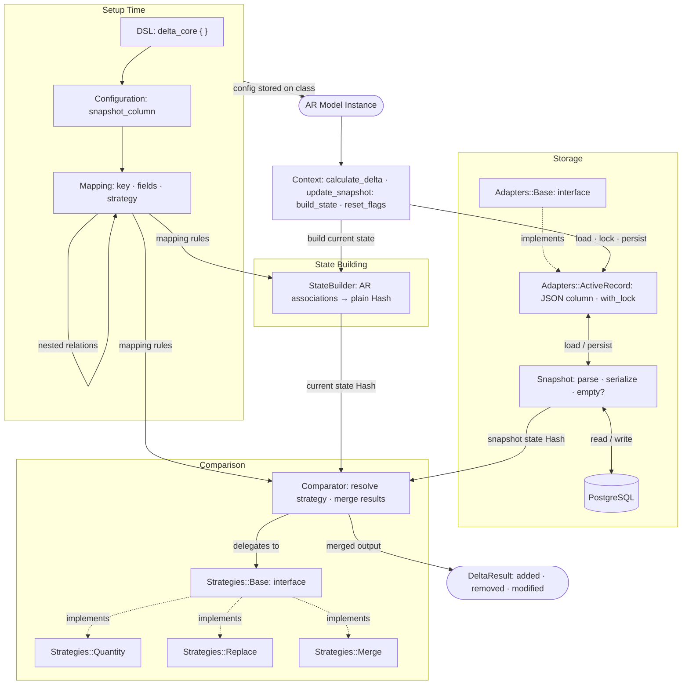

# DeltaCore

DeltaCore persists explicit snapshots of confirmed class state and compares them
against current state to produce structured, deterministic delta results. It distinguishes added,
removed, and modified entities, supports pluggable comparison strategies (quantity, replace, and
partial merge), and integrates with Rails via a configurable DSL with transactional safety and
idempotent delta generation.

## Installation

Install the gem and add it to the application's Gemfile by executing:

```bash
bundle add delta_core
```

If bundler is not being used to manage dependencies, install the gem by executing:

```bash
gem install delta_core
```

## Usage

### Rails DSL

Include the DSL in any class to configure snapshot behaviour and association
mapping rules:

```ruby
class Order < ApplicationRecord
  include DeltaCore::Model

  delta_core do
    snapshot_column :order_sign_delta_data

    map :items,
      key: :product_id,
      fields: [:quantity, :unit_price],
      strategy: :quantity,
      relations: {
        price_changes: {
          key: :id,
          fields: [:amount, :type],
          strategy: :replace
        }
      }
  end
end
```

**Configuration options:**

- `snapshot_column` — the column used to persist the serialized snapshot JSON on the record.
- `map` — declares a top-level association to track. Accepts:
  - `key:` — the unique identifier field used to match entities across snapshots.
  - `fields:` — the list of comparable fields whose changes are detected.
  - `strategy:` — comparison strategy. One of `:quantity` (count-based), `:replace` (full
    replacement), or `:merge` (partial merge of changes).
  - `relations:` — nested association mapping, using the same key/fields/strategy options.

### Taking a Snapshot

Snapshots are only persisted after external confirmation to avoid premature state capture:

```ruby
order.capture_delta_snapshot!
```

### Computing a Delta

Generate a structured delta between the last confirmed snapshot and current model state:

```ruby
delta = order.compute_delta
delta.added    # => entities present in current state but absent from snapshot
delta.removed  # => entities present in snapshot but absent from current state
delta.modified # => entities present in both with changed field values
delta.empty?   # => true when no differences exist (idempotent guard)
```

## Architecture

The diagram below covers every component in the system and the data flowing between them.
Dashed arrows (`-.->`) denote interface implementation; solid arrows denote runtime data flow.



### Key flows

**`calculate_delta`** — `Context` calls `StateBuilder` to produce a plain Hash of current
associations, loads the persisted `Snapshot` via `Adapters::ActiveRecord`, then passes both into
`Comparator`. For each `Mapping`, `Comparator` resolves the configured strategy
(`Quantity` / `Replace` / `Merge`) via `Strategies::Base` and merges the results into a
`DeltaResult`.

**`update_snapshot`** — only called after external confirmation. `Context` acquires a record lock
through `Adapters::ActiveRecord`, rebuilds current state via `StateBuilder`, serializes it through
`Snapshot`, and persists the JSON back to the PostgreSQL column. The snapshot never advances if
transmission fails.

## Development

After checking out the repo, run `bin/setup` to install dependencies. Then, run `rake spec` to
run the tests. You can also run `bin/console` for an interactive prompt that will allow you to
experiment.

To install this gem onto your local machine, run `bundle exec rake install`. To release a new
version, update the version number in `version.rb`, and then run `bundle exec rake release`,
which will create a git tag for the version, push git commits and the created tag, and push the
`.gem` file to [rubygems.org](https://rubygems.org).

## Contributing

Bug reports and pull requests are welcome on GitHub at https://github.com/mmarusyk/delta_core.
This project is intended to be a safe, welcoming space for collaboration, and contributors are
expected to adhere to the [code of conduct](https://github.com/mmarusyk/delta_core/blob/main/CODE_OF_CONDUCT.md).

## License

The gem is available as open source under the terms of the [MIT License](https://opensource.org/licenses/MIT).

## Code of Conduct

Everyone interacting in the DeltaCore project's codebases, issue trackers, chat rooms and mailing
lists is expected to follow the [code of conduct](https://github.com/mmarusyk/delta_core/blob/main/CODE_OF_CONDUCT.md).
